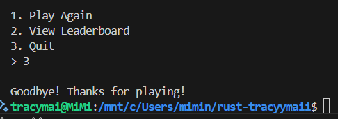

# A Game in Rust

The purpose of this assignment are:
1. Learn yet another programming language
2. Practice your creativity
3. Apply the concepts of Chapter 6: Data Types from the book
4. Have an original project that you can add to your portfolio

# Type Game in Rust

## Description
Typing Speed Racer is an interactive console-based game designed to test and improve your typing speed and accuracy. Players types while their progress is visualized as a car moving along a track. The game offers a variety of features such as sentence generation, live progress visualization, and a leaderboard to track top scores.

## How to Run
1. Install Rust
2. Clone the Repository
3. Run the game with "cargo run"

## How to Play
**Main Menu:**
Select an option by typing the corresponding number:
- 1 to start the race.
- 2 to view the leaderboard.
- 3 to quit the game.
**Race Mode:**
- Enter your name to begin.
- A random sentence will appear on the screen. Type it as quickly and accurately as possible.
- Use backspace to correct mistakes. Press Esc to cancel the race.
**Leaderboard:**
-View your past scores or the top 5 players.
**Screenshots to Show How to Play the Game**

## Link to YouTube Video
https://youtu.be/p8x412F171A

## Data Types
Enums:
- GameState: Represents the current state of the game (e.g., MainMenu, Race, Leaderboard, Quit).

Structs:
- Player: Stores player details such as name, speed, and accuracy.

File Handling:
- JSON files (history.json and top5.json) store game data for persistence.

Collections:
- Used vectors for track visualization, sentence generation, and leaderboard storage.

* Description of your Game
* How to run
* How to play (You need to show screenshots of the gameplay so a person can learn how to play your game)
  * A YouTube video showing your program running and explaining how it goes.
* Data types (How you applied some concepts from the book in your code, you can reference/use the comments you wrote in your code)
* Difficulties and Solutions (What challenges you found and how you overcame them)
* The Good, the Bad and the Ugly (What you loved about this experience, what has bad, and what did you disliked)
* Learning Experience (briefly explain what you learn in this assignment)
